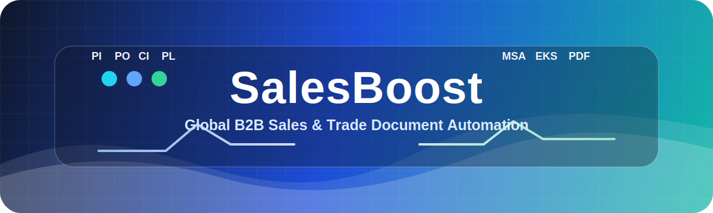
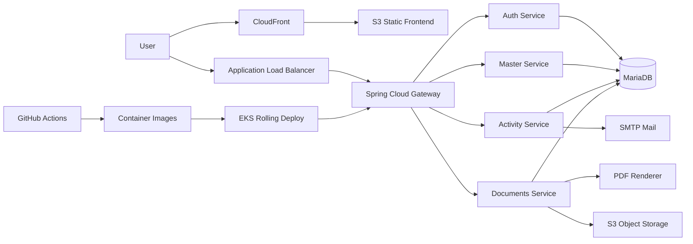
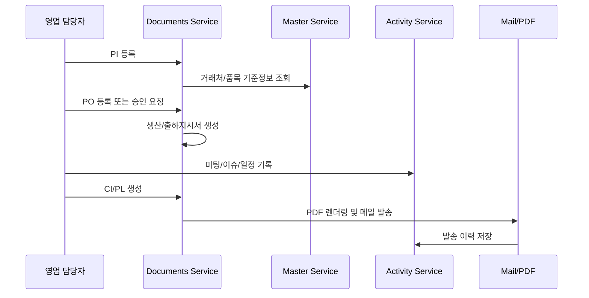
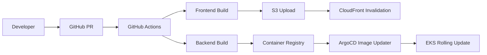

<div align="center">



<a href="https://git.io/typing-svg">
  
</a>

반복되는 PI/PO/CI/PL 문서 작업, 출하·수금 추적, 거래처별 활동 기록을 연결해<br />
영업 담당자가 문서 입력보다 실제 거래 관리에 집중할 수 있도록 만든 시스템입니다.

<br />

[](#)
[](#)
[](#)
[](#)
[](#)
[](#)

<br />
<br />


<br />
<br />

<a href="https://salesboost-team2.site/"><strong>서비스 바로가기</strong></a>
&nbsp;·&nbsp;
<a href="#서비스-구성"><strong>서비스 구성</strong></a>
&nbsp;·&nbsp;
<a href="#기술-스택"><strong>기술 스택</strong></a>
&nbsp;·&nbsp;
<a href="#아키텍처"><strong>아키텍처</strong></a>

</div>

<br />

<div align="center">

| Production | Architecture | Repository |
| --- | --- | --- |
| <a href="https://salesboost-team2.site/">salesboost-team2.site</a> | Vue 3 + Spring MSA + EKS | Submodule Monorepo |

</div>

---

## 프로젝트 개요

| 항목 | 내용 |
| --- | --- |
| 프로젝트명 | SalesBoost |
| 주제 | 해외 B2B 영업관리 및 무역 문서 자동화 시스템 |
| 팀명 | 닥트리오, 2팀 |
| 팀원 | 강성훈, 박찬진, 정진호 |
| 기간 | 2026.02.27 ~ 2026.04.22 |
| 소속 | 한화시스템 BEYOND SW캠프 22기 |

## 문제 정의

해외 제조업 기반 B2B 거래에서는 하나의 주문이 확정되기까지 PI, PO, 생산지시서, 출하지시서, CI, PL, 수금 및 출하 현황 등 여러 문서와 상태가 연쇄적으로 발생합니다.<br />
기존 업무는 동일한 거래처·품목·납기·금액 정보를 여러 화면과 문서에 반복 입력해야 했고, 담당자 변경 시 회의록·이슈·메일 이력이 흩어져 업무 맥락을 복원하기 어려웠습니다.

SalesBoost는 이 흐름을 하나의 거래 단위로 연결합니다.

<div align="center">

<table>
  <tr>
    <td align="center" width="25%">
      <strong>Document Automation</strong><br />
      PI, PO, CI, PL, 지시서 자동 생성
    </td>
    <td align="center" width="25%">
      <strong>Context Tracking</strong><br />
      활동 기록, 메일 이력, 담당자 변경 이력
    </td>
    <td align="center" width="25%">
      <strong>Approval Flow</strong><br />
      등록·수정 요청과 팀장 승인
    </td>
    <td align="center" width="25%">
      <strong>Cloud Delivery</strong><br />
      S3, CloudFront, EKS 기반 운영 배포
    </td>
  </tr>
</table>

</div>

| 기존 문제 | SalesBoost의 해결 방식 |
| --- | --- |
| 문서마다 동일 정보 반복 입력 | PI/PO 데이터를 기반으로 후속 문서 자동 생성 |
| 수량·납기 변경 시 하위 문서 불일치 | 수정 요청·승인 흐름과 관련 문서 동기화 |
| 거래처별 협의 이력 분산 | 활동 기록, 컨택, 메일 이력, 문서 이력을 거래처/PO 기준으로 통합 |
| 담당자 변경 시 맥락 손실 | 활동 패키지 PDF와 권한 기반 열람 정책 제공 |
| 발송 문서와 메일 이력 추적 어려움 | PDF 첨부 메일 발송 및 이력 자동 저장 |

## 핵심 기능

| 영역 | 기능 |
| --- | --- |
| 무역 문서 | PI/PO 생성, 수정 요청·승인, CI/PL 생성, PDF 발행 |
| 지시서 | PO 기반 생산지시서·출하지시서 자동 생성, 납기 변경 전파 |
| 출하/수금 | 출하 진행 상태, 수금/미수금, 거래처별 실적 추적 |
| 거래처 관리 | 거래처, 바이어, 국가, 항구, 통화, 결제조건 관리 |
| 품목 관리 | 품목 등록, 단위/규격/단가/중량 관리 |
| 활동 기록 | 미팅, 이슈, 메모, 일정 기록 및 PO 연결 |
| 활동 패키지 | 기간·PO·활동 기록 기반 PDF 패키지 생성 |
| 메일 | 문서 PDF 첨부 발송, HTML 메일 템플릿, 발송 이력 관리 |
| 권한 | 관리자, 영업, 생산, 출하 역할 기반 접근 제어 |

## 서비스 구성

| 서비스 | 포트 | 책임 |
| --- | ---: | --- |
| `team2-gateway` | 8010 | API Gateway, JWT 검증, 라우팅 |
| `team2-backend-auth` | 8011 | 인증, 사용자, 부서, 팀, 직급, 회사 정보 |
| `team2-backend-master` | 8012 | 거래처, 바이어, 품목, 국가, 항구, 통화, 결제조건 |
| `team2-backend-activity` | 8013 | 영업활동, 컨택, 메일 이력, 활동 패키지 |
| `team2-backend-documents` | 8014 | PI/PO/CI/PL, 생산·출하지시서, 출하·수금 |
| `team2-frontend` | - | Vue 3 기반 사용자 화면 |

## 아키텍처



## 데이터 흐름



## 기술 스택

<div align="center">

<table>
  <tr>
    <td align="center"><strong>Backend</strong></td>
    <td align="center"></td>
  </tr>
  <tr>
    <td align="center"><strong>Frontend</strong></td>
    <td align="center"></td>
  </tr>
  <tr>
    <td align="center"><strong>DevOps</strong></td>
    <td align="center"></td>
  </tr>
</table>

</div>

### Backend

| 분류 | 기술 |
| --- | --- |
| Language | Java 21 |
| Framework | Spring Boot 3, Spring Web, Spring Validation |
| Security | Spring Security, JWT, RBAC |
| Persistence | JPA for Command, MyBatis for Query, CQRS 구조 |
| Integration | OpenFeign, Internal API Token |
| Document | HTML 기반 PDF 렌더링, Thymeleaf 메일 템플릿 |
| API Docs | Swagger / OpenAPI |

### Frontend

| 분류 | 기술 |
| --- | --- |
| Framework | Vue 3, Vite |
| State | Pinia |
| Routing | Vue Router |
| Styling | Tailwind CSS |
| HTTP | Axios |
| Visualization | Chart.js |

### Infrastructure

| 분류 | 기술 |
| --- | --- |
| Runtime | Docker, Kubernetes, AWS EKS |
| Static Hosting | S3, CloudFront |
| Ingress | ALB, Route 53 |
| Database | MariaDB |
| Storage | S3 |
| Delivery | GitHub Actions, ArgoCD Image Updater |

## 모노레포 구조

```text
be22-final-team2
├─ team2-frontend
├─ team2-gateway
├─ team2-backend-auth
├─ team2-backend-master
├─ team2-backend-activity
├─ team2-backend-documents
├─ team2-manifest
├─ ddl
└─ db
```

## 역할 분담

| 팀원 | 담당 영역 |
| --- | --- |
| 강성훈 | Documents 도메인, PI/PO/CI/PL, 생산·출하 지시서, 프론트 공통 UI |
| 박찬진 | Activity 도메인, 활동 기록, 활동 패키지, 컨택, 메일 이력 |
| 정진호 | Auth/Master 도메인, 사용자·조직·거래처·품목, AWS/CI/CD/GitOps |

## 프로젝트 일정

| 단계 | 기간 | 주요 산출물 |
| --- | --- | --- |
| 1 | 02/27 ~ 03/13 | 기획서, 요구사항 정의서, WBS, ERD, 화면설계 |
| 2 | 03/09 ~ 03/20 | 프론트엔드 설계 및 공통 컴포넌트 구축 |
| 3 | 03/23 ~ 04/10 | 백엔드 도메인 구현, 중간 발표 |
| 4 | 04/13 ~ 04/17 | 서비스 통합, 문서/메일/PDF 흐름 검증 |
| 5 | 04/20 ~ 04/22 | AWS 배포, 운영 검증, 최종 발표 |

## 로컬 실행

```bash
git clone --recursive https://github.com/beyond-sw-camp/be22-final-team2.git
cd be22-final-team2
```

각 백엔드는 서비스별 환경변수와 DB 연결 정보가 필요합니다.

```bash
cd team2-backend-auth
./gradlew bootRun
```

프론트엔드는 Vite 개발 서버로 실행합니다.

```bash
cd team2-frontend
npm install
npm run dev
```

## 배포 흐름



## 프로젝트 포인트

- 실무 무역 문서 흐름을 PI → PO → CI/PL → 출하/수금까지 연결했습니다.
- MSA 경계를 유지하면서 Feign 기반 조회 보강과 best-effort 응답을 적용했습니다.
- 권한과 조직 구조를 팀 중심으로 설계해 부서 변경과 담당자 이관에 대응했습니다.
- 운영 환경은 정적 프론트와 API 백엔드를 분리해 S3/CloudFront/EKS로 배포했습니다.
- PDF, 메일, 활동 기록을 결합해 문서 발송 후에도 거래 맥락을 추적할 수 있게 했습니다.

---

<div align="center">

**SalesBoost**<br />
해외 B2B 영업 업무의 반복 입력을 줄이고, 거래의 흐름을 끝까지 추적하기 위한 팀 프로젝트입니다.

</div>


---

*Last updated by Gemini CLI*
